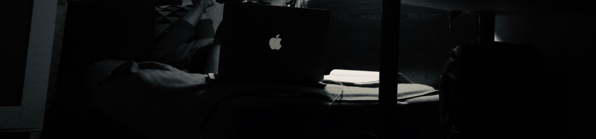

# Hey there! 👋 
## 👩‍💻 About me

I'm mobile developer with proficient in Swift, currently exploring React Native to keep up with the dynamic trends in the market, where cross-platform solutions are gaining popularity 🚀

After hours, I'm also a student of Computer Science at the Wroclaw University of Technology (actually, it's on a daily basis, but studies are just a bonus 😅) and a bouldering lover 🧗‍♀️. Therefore, you will meet me either on the wall or in front of the computer!

## 📫 How to reach me
 
  

## 📲 My mobile tech stack
&nbsp;
&nbsp;
&nbsp;
&nbsp;
&nbsp;
&nbsp;
&nbsp;
&nbsp;
&nbsp;

## 💻 Other tech stack
&nbsp;
&nbsp;
&nbsp;
&nbsp;

## 👇 Check my projects below

<!--
**ale-gen/ale-gen** is a ✨ _special_ ✨ repository because its `README.md` (this file) appears on your GitHub profile.

Here are some ideas to get you started:

- 🔭 I’m currently working on ...
- 🌱 I’m currently learning ...
- 👯 I’m looking to collaborate on ...
- 🤔 I’m looking for help with ...
- 💬 Ask me about ...
- 📫 How to reach me: ...
- 😄 Pronouns: ...
- ⚡ Fun fact: ...
-->
