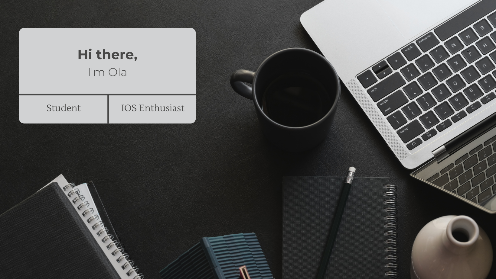

# 👩‍💻 About me

My name is Aleksandra Generowicz and I am a third year student of Applied Computer Science at Wrocław University of Science and Technology. Despite some experience with programming languages like Python or Java, I have started learning Swift to develop my own applications on IOS. Quickly I understood, that was it. Currently, I constantly broaden my knowledge to build more and more incredible apps with beautiful design!

 
  

## 📲 Tech stack used for IOS development

## 💻 Other tech stack

<!--
**ale-gen/ale-gen** is a ✨ _special_ ✨ repository because its `README.md` (this file) appears on your GitHub profile.

Here are some ideas to get you started:

- 🔭 I’m currently working on ...
- 🌱 I’m currently learning ...
- 👯 I’m looking to collaborate on ...
- 🤔 I’m looking for help with ...
- 💬 Ask me about ...
- 📫 How to reach me: ...
- 😄 Pronouns: ...
- ⚡ Fun fact: ...
-->
